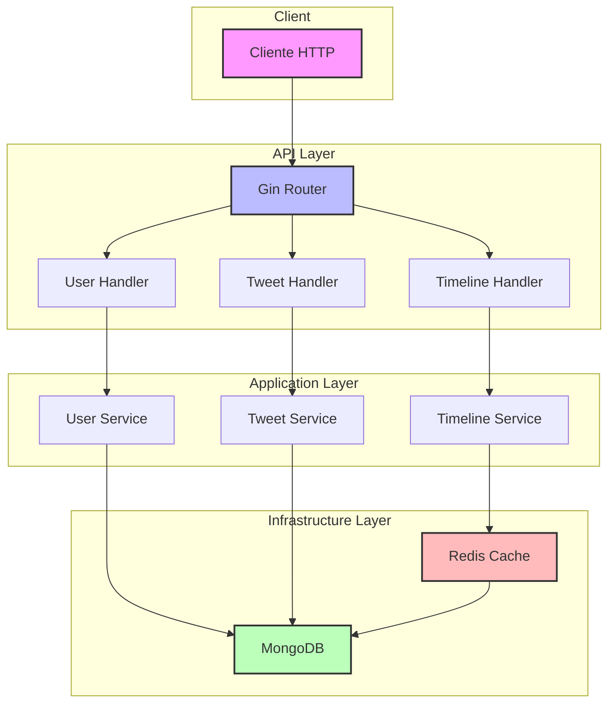
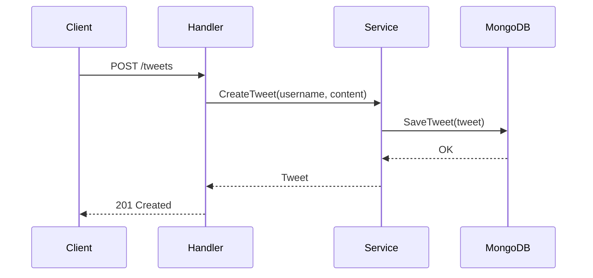
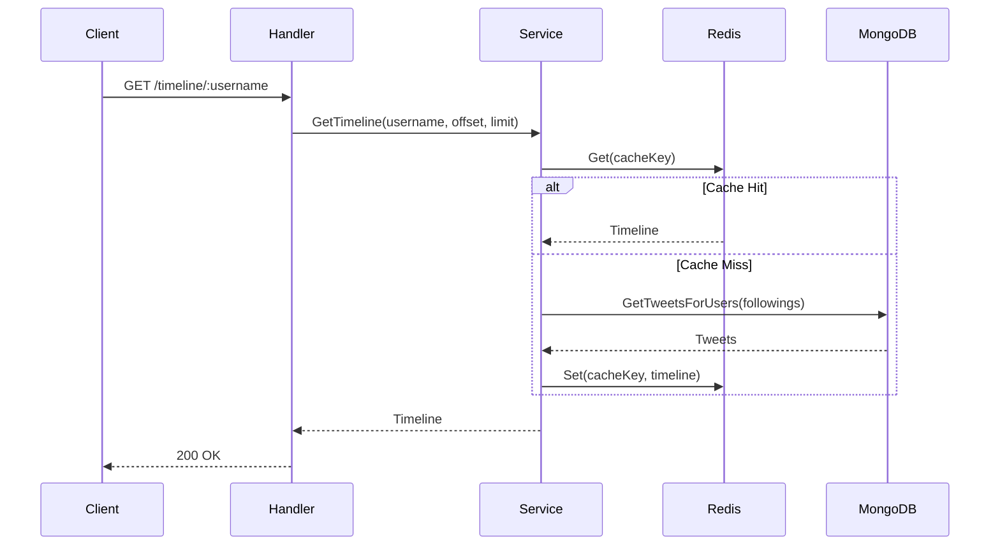
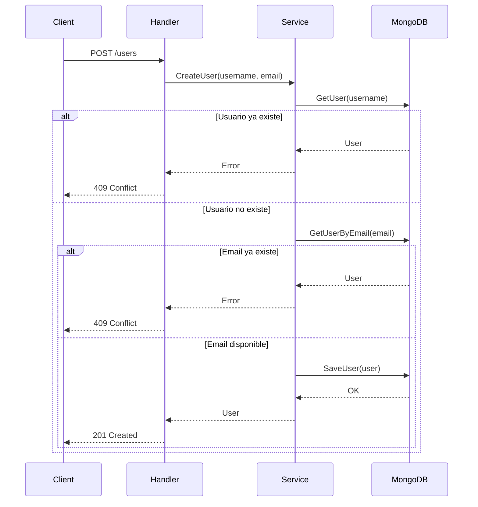
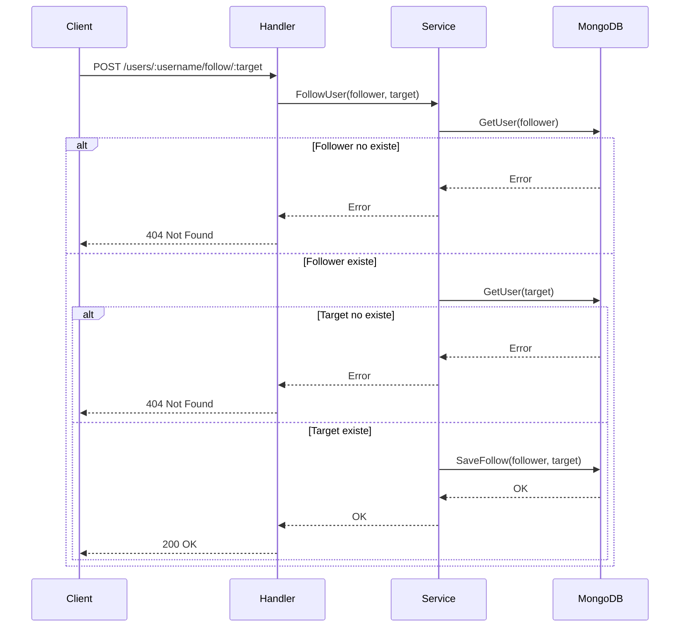

# Twitter-like API Challenge

## Descripción

Este proyecto es una implementación simplificada de una plataforma de microblogging similar a Twitter. Permite a los usuarios publicar tweets, seguir a otros usuarios y ver un timeline personalizado.

## Características Principales

- Publicación de tweets (máximo 280 caracteres)
- Sistema de seguimiento entre usuarios
- Timeline personalizado con tweets de usuarios seguidos
- Arquitectura escalable y optimizada para lecturas
- Cache implementado con Redis
- Base de datos MongoDB para almacenamiento persistente
- Eventos asíncronos con Kafka **[NO implementado]**

## Requisitos Previos

- Go 1.22 o superior
- Docker y Docker Compose
- MongoDB
- Redis
- Kafka **[NO implementado]**

## Instalación

### 1. Clonar el Repositorio

```bash
git clone https://github.com/nicodelara/microblogging-uala.git
cd microblogging-uala
```

### 2. Instalar Dependencias

```bash
go mod download
```

## Ejecución

### Usando Docker Compose (Recomendado)

1. Construir y levantar los servicios:

```bash
docker compose up --build
```

Esto iniciará los siguientes servicios:

- Tweets Service: http://localhost:8081 (API para gestión de tweets)
- Users Service: http://localhost:8082 (API para gestión de usuarios)
- Timeline Service: http://localhost:8083 (API para gestión de timelines)
- MongoDB: localhost:27017 (Base de datos principal)
- Redis: localhost:6379 (Sistema de caché)
- RedisInsight: http://localhost:8001 (Interfaz de administración de Redis)
- Zookeeper: localhost:2181 (Coordinador de servicios distribuidos)
- Kafka: localhost:9092 **[NO implementado]** (Sistema de mensajería)
- AKHQ (Kafka UI): http://localhost:8080 (Interfaz de administración de Kafka)
- API Docs: http://localhost:8085 (Documentación de la API)

- Para visualizar la cache de Redis recomiendo tener [RedisInsight](https://redis.io/insight/)
- Para visualizar la base de datos MongoDB recomiendo tener [MongoDB Compass](https://www.mongodb.com/try/download/compass)

Para verificar el estado de los servicios:

```bash
docker compose ps
```

Para ver los logs de un servicio específico:

```bash
docker compose logs -f [servicio]
```

## Estructura del Proyecto

```
.
├── cmd/                    # Punto de entrada de la aplicación
│   ├── tweets/           # Servicio de tweets
│   ├── users/            # Servicio de usuarios
│   └── timeline/         # Servicio de timeline
├── configs/              # Archivos de configuración
│   └── openapi/         # Documentación OpenAPI
├── internal/            # Código interno de la aplicación
│   ├── common/         # Código compartido
│   ├── tweets/         # Módulo de tweets
│   ├── users/          # Módulo de usuarios
│   └── timeline/       # Módulo de timeline
└── pkg/                # Paquetes públicos reutilizables
```

## API Endpoints

### Tweets Service (8081)

- `POST /tweets` - Crear un nuevo tweet
  ```json
  {
    "username": "string",
    "content": "string (max 280 chars)"
  }
  ```

### Users Service (8082)

- `POST /users` - Crear un nuevo usuario
  ```json
  {
    "username": "string",
    "email": "string"
  }
  ```

### Timeline Service (8083)

- `GET /timeline/{username}` - Obtener timeline de un usuario

## Documentación API

La documentación completa de la API está disponible en:

- API Docs: http://localhost:8085

## Arquitectura

El proyecto sigue los principios de Clean Architecture con las siguientes capas:

- Domain: Entidades y reglas de negocio
- Application: Casos de uso y lógica de aplicación
- Infrastructure: Implementaciones concretas (bases de datos, cache, etc.)

## Testing

Ejecutar los tests:

```bash
go test ./...
```

## Consideraciones de Escalabilidad

- Uso de Redis para caché de lecturas frecuentes
- MongoDB para almacenamiento distribuido
- Kafka para eventos asíncronos **[NO implementado]**
- Arquitectura modular para facilitar el escalamiento horizontal
- Optimización para operaciones de lectura

## Diagrama de Arquitectura



## Secuencia de Flujos

### Creacion de Tweet



### Obtener Timeline de un usuario



### Creacion de usuario



### Seguir a un usuario



## Licencia

MIT
